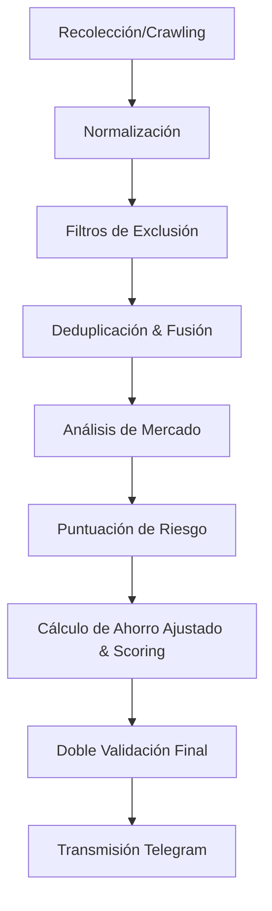

# Aurea Car Monitor 🚗💨

Aurea es una herramienta local de monitorización y análisis de anuncios de vehículos de segunda mano en España (**Wallapop**, **Milanuncios** y **Coches.net**). Su objetivo principal es detectar **exclusivamente** oportunidades excepcionales de compra (clasificadas como `10/10`) y enviar alertas automáticas mediante Telegram.

El sistema está diseñado bajo una filosofía **extremadamente conservadora**: prefiere omitir alertas durante semanas antes que enviar una falsa ganga.

---

## 🛠️ Arquitectura y Funcionamiento

Aurea funciona mediante un pipeline por fases modular y estrictamente tipado:



1. **Recolección:** Conectores modulares obtienen los datos de Wallapop, Milanuncios y Coches.net.
2. **Normalización:** Homogeneización de marcas, modelos, combustibles y transmisiones.
3. **Filtros de Exclusión:** Descarte inmediato de anuncios antiguos (>30 días), dañados ("motor roto"), con financiación camuflada o cuotas mensuales.
4. **Deduplicación:** Lógica difusa basada en kilometraje, precio, ubicación y texto para unir publicaciones idénticas entre portales o detectar republicaciones (con registro de históricos de precio).
5. **Análisis de Mercado:** Estimación estadística del precio medio y desviación a partir de comparables idénticos (+/- 1 año de antigüedad, +/- 35.000 km).
6. **Puntuación de Riesgo:** Algoritmo que puntúa riesgos (importación, sospecha de kilómetros, averías ocultas) entre 0 y 100.
7. **Scoring de Ahorro Ajustado:** Deduce costes de mantenimiento próximo (distribución inminente, etc.) y reparaciones previsibles. Solo coches con un ahorro ajustado >= 3.000 € y descuento >= 20% son candidatos.
8. **Doble Validación:** Verificación en tiempo real antes de enviar la alerta (confirmar precio, cuotas y exclusiones críticas).
9. **Transmisión de Alerta:** Envío de una ficha rica a Telegram. En caso de caída de la API de Telegram, la alerta queda en cola en la base de datos local SQLite (`data/aurea.db`) para su posterior reenvío automático sin duplicar alertas.

---

## 📂 Estructura del Proyecto

```text
Aurea-CarFinding/
├── config/
│   ├── settings.yaml          # Umbrales, parámetros de scraping y Telegram
│   ├── searches.yaml          # Criterios de búsqueda activos (marcas, modelos, etc.)
│   ├── settings.example.yaml  # Plantilla de settings
│   └── searches.example.yaml  # Plantilla de búsquedas
├── data/
│   └── aurea.db               # Base de datos SQLite (auto-generada)
├── src/
│   └── aurea/
│       ├── __init__.py
│       ├── __main__.py        # Entrypoint del módulo Python
│       ├── cli.py             # Comandos de consola con Typer y Rich
│       ├── config.py          # Gestión y validación de configs con Pydantic
│       ├── database.py        # Configuración de SQLite y SQLModel
│       ├── deduplication.py   # Lógica de equivalencia y republicaciones
│       ├── filters.py         # Filtros de exclusión y negaciones complejas
│       ├── market.py          # Estadísticas de mercado y percentiles
│       ├── models.py          # Esquema de base de datos SQLModel
│       ├── normalizer.py      # Normalizador de datos y extractor de texto
│       ├── pipeline.py        # Orquestador del pipeline completo de análisis
│       ├── risk.py            # Puntuador de riesgo del vehículo
│       ├── scoring.py         # Motor de scoring y cálculo de ahorro ajustado
│       ├── telegram.py        # Transmisión y reintentos del bot de Telegram
│       └── sources/           # Conectores para portales
│           ├── base.py
│           ├── coches_net.py
│           ├── milanuncios.py
│           └── wallapop.py
├── tests/
│   └── test_aurea.py          # Suite completa de tests unitarios y de integración
├── pyproject.toml             # Metadatos del proyecto y dependencias
└── README.md
```

---

## 🚀 Instalación y Configuración

### Requisitos Previos
* Python 3.12 o superior.

### 1. Clonar el repositorio e instalar en modo editable
```bash
python -m pip install -e .[dev]
```

### 2. Configurar Variables de Entorno
Crea un archivo `.env` en la raíz del proyecto basándote en `.env.example`:
```ini
TELEGRAM_BOT_TOKEN=tu_token_de_telegram
TELEGRAM_CHAT_ID=tu_chat_id
```

### 3. Configurar Parámetros y Búsquedas
* Edita `config/settings.yaml` para ajustar los umbrales estadísticos y de seguridad.
* Edita `config/searches.yaml` para añadir las marcas, modelos y criterios de coches que quieres monitorizar.

---

## 💻 Comandos del CLI

Aurea proporciona una interfaz interactiva y rica usando `Typer` y `Rich`:

### 🔄 Ejecutar Monitorización
Busca nuevos anuncios, aplica el pipeline completo, guarda resultados y notifica a Telegram:
```bash
python -m aurea run
```

### 📋 Ver Historial de Oportunidades
Muestra una tabla con todas las alertas catalogadas como `AUREA` (10/10):
```bash
python -m aurea history
```
*Puedes filtrar por marca o portal:*
```bash
python -m aurea history --make Toyota --source wallapop
```

### 🔍 Mostrar Ficha Detallada
Muestra el desglose de costes, valoración estimada de mercado, ahorro ajustado, confianza estadística y puntos a revisar de un coche:
```bash
python -m aurea show AU-000001
```

### 📊 Ver Estadísticas Globales
Resumen del estado de la base de datos (alertas enviadas, fallidas en cola, precio histórico):
```bash
python -m aurea stats
```

### 🩺 Diagnóstico del Sistema
Comprueba la validez de los ficheros de configuración, base de datos local SQLite y estado de la conexión a Telegram:
```bash
python -m aurea doctor
```

### ✉️ Probar Telegram
Envía un mensaje de verificación directamente a tu canal o chat:
```bash
python -m aurea test-telegram
```

---

## 🧪 Tests Unitarios

La suite de tests cubre casos extremos para garantizar que ninguna falsa oportunidad genere alertas falsas:
* Exclusión por financiación oculta y cuotas mensuales.
* Detección y omisión de averías ocultas (junta culata, etc.) respetando frases negadas.
* Deduplicación de vehículos idénticos entre diferentes portales.
* Penalización por falta de comparables o baja fiabilidad mecánica.
* Cálculo exacto de ahorro real deduciendo costes predecibles.

Para ejecutar los tests:
```bash
python -m pytest -v
```

---

## 🤖 Automatización con GitHub Actions

El workflow en `.github/workflows/monitor.yml` está preconfigurado para ejecutar la monitorización cada **2 horas** de forma desatendida. Para mantener el histórico de la base de datos local SQLite y evitar notificaciones repetidas, el workflow realiza automáticamente un commit de `data/aurea.db` de vuelta al repositorio tras cada ejecución.
